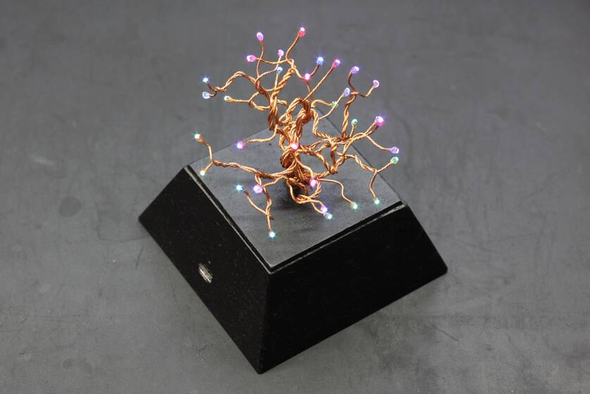

# STM32F030F4P6 LED Tree

This repository contains the code for a 8-by-6 RGB LED matrix driver with software 12-bit BCM output based on a STM32F030F4P6 and some additional code for brightness control and a pretty animation. More information about the project can be found [here](https://25120.org/post/laurelin/).

## Licence

The header files in the third_party directory are provided by ARM Limited and ST Microelectronics and contain their own licence information. Everything else is ISC licenced.
